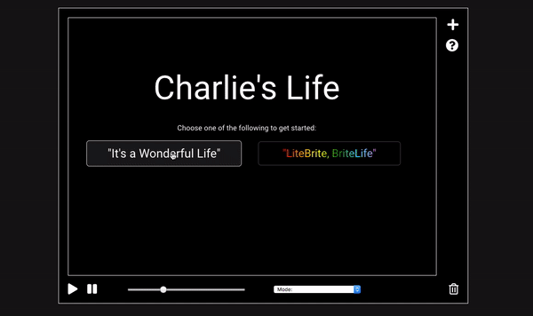

# Charlie's Life

## Background and overview
Charlie's Life is an interactive implementation of John Horton Conway's [Game of Life](https://en.wikipedia.org/wiki/Conway%27s_Game_of_Life).

The game is a cellular automaton - a grid of cells, each of which have a finite number of states and follow a set of rules which determine their state.

In this game, cells can have 2 states - alive or dead - and they follow 4 simple rules:
1. **Underpopulation** - A cell dies if it has less than 2 living neighbors
2. **Continuation** - A cell with 2-3 neighbors will stay alive
3. **Overpopulation** - A cell dies if it has more than 3 neighbors
4. **Reproduction** - A cell is born if it has exactly 3 living neighbors

In Charlie's Life, users can interact with the game by adding live cells to the grid at any time (during an active or paused game), by allowing cells to take on additional states (colors), and by changing the speed of the game.

## Functionality

In Charlie's Life, users are able to:
* Start the game with a randomly seeded board
* Pause & re-start the simulation, as well as clear the game of all live cells
* Easily change the speed of the game using a slide bar
* Choose between default (black and white) and 'immigration' (color) implementations of Conway's game
* Access a side bar of pre-determined shapes that can be added to the board
* Access a pop-up with more information about the game & controls

### Basic Algorithm for the Game of Life & Color Domination

```javascript
    // Basic Rules: 1 = alive, 0 = dead
    lifeRules(numAlive) {
      let newState = this.state;
      if(numAlive < 2 || numAlive > 3) {
        newState = 0;
      } else if (numAlive === 3) {
        newState = 1;
      }

      if(newState > 1) newState = 1;
      return newState;
    }

    //Rules to give cells colors
    // States between 2-7 are associated with certain colors
    // nextState is determined by getNextState() below
    brightlifeRules(numAlive, nextState) {
      let newState = this.state;
      if(numAlive < 2 || numAlive > 3) {
        newState = 0;
      } else if (numAlive === 3) {
        newState = nextState;
      }

      //Cells without determined colors have randomized states
      if (newState === 1) newState += Math.floor((Math.random() * 6) + 1);
      return newState;
    }

    //Is there a common color among your neighbors cells?
    // If so, become that color..
    // otherwise, let brightlifeRules() choose a color for you
    getNextState(neighborStates) {
      let sortedStates = neighborStates.sort((a,b) => a - b);
      for (let i = 0; i < sortedStates.length; i++) {
        if(sortedStates[i] === sortedStates[i+1]) return sortedStates[i];
      }
      return 1;
    }
```

### Random Clustering


```javascript
    //If cells are not clustered at all, they will all immediately die
    //This algorithm chooses random central 'nodes' or cells that must
    // be a certain distance from one another
    // Then, clusters a random number of cells that must be a within a
    // max distance from the central node
    randomClusters() {
      let numCenterCells = Math.floor((Math.random() * 25) + 25);
      let centerCells = [], clusterCells = [];
      let minDis = 20, maxDis = 10;

      for (let i = 0; i < numCenterCells; i++) {
        let x = Math.floor(Math.random() * 70);
        let y = Math.floor(Math.random() * 100);
        let validCell = true;

        for (let j = 0; j < centerCells.length; j++) {
          let xDiff = Math.abs(centerCells[j].row - x) <= minDis;
          let yDiff = Math.abs(centerCells[j].col - y) <= minDis;
          if(xDiff && yDiff){
            validCell = false;
            break;
          }
        }

        if(validCell) {
          let centerCell = this.grid[x][y];
          centerCells.push(centerCell);
          let numClusterCells = Math.floor((Math.random() * 10) + 20);
          for (let k = 0; k < numClusterCells ; k++) {
            let a = Math.floor((Math.random() * 10) + 1) * (Math.random() < 0.5 ? -1 : 1);
            let b = Math.floor((Math.random() * 10) + 1) * (Math.random() < 0.5 ? -1 : 1);

            let newX = (centerCell.row + a) % this.rows;
            newX = newX < 0 ? newX + this.rows : newX;

            let newY = (centerCell.col + b) % this.cols;
            newY = newY < 0 ? newY + this.cols : newY;

            clusterCells.push(this.grid[newX][newY]);
          }
        }
      }
    }
```


## Design

Charlie's Life is a single-screen application with a simple but intuitive design and user interface. The game consist of a main simulation area, containing around 7,000 cells. The user will click on this area to begin the game.



Controls along the bottom of the simulation area allow the user to pause/play the simulation, speed up or slow down the simulation, toggle between game modes, or clear the board.

In the top right of the screen, the user can either toggle a sidebar with additional controls, or open pop-up window that describes each of the controls in detail. The additional sidebar controls allow the user to add live cells to the board: randomly, in a full row, in a full column, or in various pre-constructed shapes - gliders, guns, and spaceships.

## Technologies and Architecture
This project will be implemented with the following technologies:
* Pure Javascript - the game logic and DOM manipulation (no additional libraries or frameworks)
* Webpack - Bundle and serve up the scripts
* Animate.css - For title and sidebar animations

In addition to the `bundle.js` entry file served up by webpack, the following scripts will be included:

* `actions.js` - sets all event listeners for all controls on the board
* `board_actions.js` - logic for user interaction with the board (adding shapes)
* `board.js` - maintains the grid, updateBoard logic, and random cluster algorithm
* `cell.js` - logic for determining the state of a given cell, game of life algorithm
* `game.js` - logic for the game rules, speed, and play/pause; creates the board
* `index.js` - entry point, creates the game object and events after DOM content is loaded
* `sidebar_actions.js` - sets all event listeners for all controls in the sidebar
* `utils.js` - reusable code to quickly create event listeners

Additional scripts may be created as code is written and refactored.

## Possible Future Features
Features that could be added:
 * A library of pre-constructed 'shapes' (eg. spaceships, guns, etc)
 * Heat-mapping - Cell colors change depending on how long they have 'survived'
