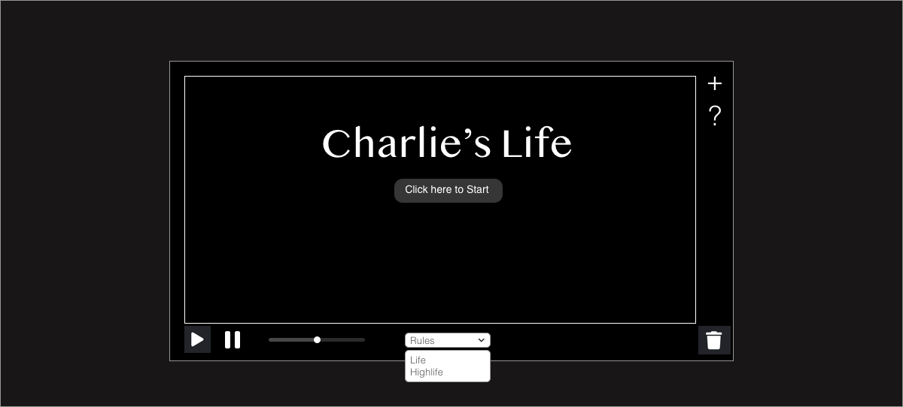

# Charlie's Life

## Background and overview
Charlie's Life is an interactive implementation of John Horton Conway's [Game of Life](https://en.wikipedia.org/wiki/Conway%27s_Game_of_Life).

The game is a cellular automaton, meaning that it is made up of a grid of cells, each of which have a finite number of states and follow a set of rules which determine their state.

In this game, cells can have 2 states - alive or dead - and they follow 4 simple rules:
1. Underpopulation - A cell dies if it has less than 2 living neighbors
2. Continuation - A cell with 2-3 neighbors will stay alive
3. Overpopulation - A cell dies if it has more than 3 neighbors
4. Reproduction - A cell is born if it has exactly 3 living neighbors

In Charlie's life, users will be allowed to modify some of these rules and force state changes for some of the cells on the grid in order to experiment and play with the game.

## Functionality and MVP

In Charlie's Life, users will be able to:
* Start the game (with on click) with a pre-seeded board
* Pause & re-start the game, as well as clear the game of all live cells
* Easily change the speed of the game using a slide bar
* Choose between 'Life' and 'HighLife' implementations of the game
* Access a side bar of pre-determined shapes that can be added to the board
* Access a side bar with more information about how the game works

## Design & Wireframes

## Technologies and Architecture

## Implementation Timeline

### Before Day 1 (over the weekend):

### Day 1:

### Day 2:

### Day 3:

### Day 4:

### Day 5:

## Bonus Features
There are a number of features that could be added:
 * Additional pre-constructed 'shapes' (eg. spaceships, guns, etc)
 * Color states could be added (such as the Immigration implementation)
